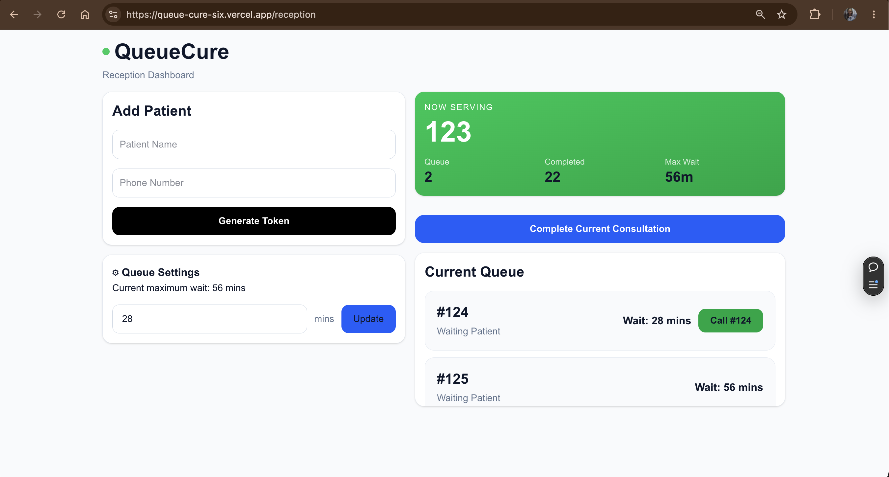
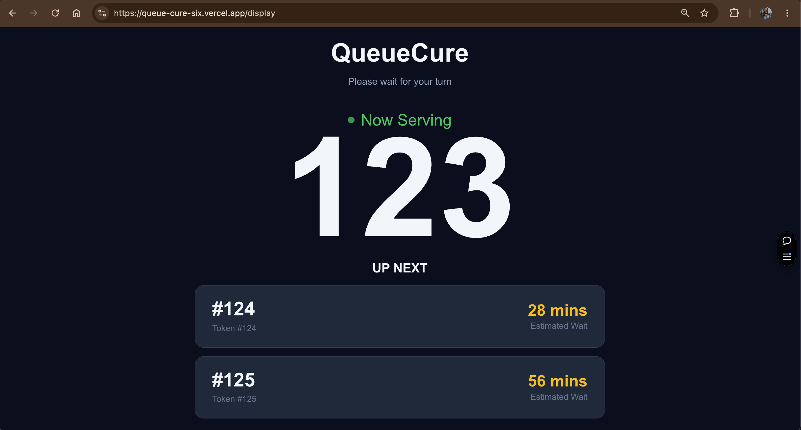

# 🏥 Queue Cure '26

### Bringing transparency to India's clinic waiting rooms.

A real-time clinic queue management system that replaces paper token slips with synchronized digital experiences for both receptionists and patients.

Built for **Queue Cure '26**, a full-stack hackathon hosted by Wooble.

---

## The Problem

76% of India's 1.5 million clinics still rely on paper token systems. Patients often wait for hours without knowing when they'll be called, while receptionists manually manage queues and repeatedly answer the same questions:

> "How much longer?"

> "Who's next?"

> "Has my turn come?"

This lack of visibility creates stress for patients and increases cognitive load for clinic staff.

---

## Our Solution

Queue Cure transforms traditional waiting rooms into transparent, real-time experiences through live queue visibility and synchronized displays.

| The Problem | Queue Cure |
|-------------|------------|
| Paper token slips | Digital queue management |
| Patients wait blindly | Estimated wait times |
| Receptionists manage everything manually | Mistake-proof dashboard |
| Patients repeatedly ask for updates | Waiting room display |
| No synchronization | Real-time Socket.IO updates |

---

# 📸 Product Preview

## Reception Dashboard

Designed for fast-paced clinic workflows.



Features:
- Add new patients
- Generate queue tokens automatically
- Call the next patient
- View current queue
- Configure average consultation time
- Prevent accidental duplicate actions

---

## Patient Waiting Room Display

Designed to be viewed from across the room.



Features:
- Displays current token being served
- Shows upcoming patients
- Displays tokens ahead
- Calculates estimated wait times
- TV-friendly interface with no scrolling
- Handles empty queue states gracefully

---

# Why Queue Cure?

Queue Cure wasn't built to showcase forms and tables.

It was built to solve a very real problem faced by millions of patients and thousands of clinics every day.

By reducing uncertainty for patients and simplifying queue management for receptionists, Queue Cure demonstrates how thoughtfully designed technology can improve everyday healthcare experiences.

---

# 💡 The Moment That Matters

"When the receptionist clicks 'Call Next' and every patient screen in the clinic updates instantly without anyone refreshing the page."

This is the moment that demonstrates Queue Cure's value to a clinic owner.

---

# ⚙️ The Engineering Challenge

The challenge wasn't building forms.

The real challenge was ensuring that:

- Two independent screens remained synchronized in real time.
- Wait times were calculated dynamically from actual queue data.
- Receptionists couldn't accidentally trigger duplicate actions.
- Patients always saw the latest queue state without refreshing.
- The display screen remained usable as a passive TV interface.

---

# 🎯 Key Design Decisions

## TV-First Patient Experience

Patients don't have access to keyboards or mice.

Therefore, the waiting room display was designed with:

- Large typography
- High contrast visuals
- No scrolling
- Top 3 upcoming tokens only
- Clear wait estimates

---

## Mistake-Proof Reception Workflow

Receptionists operate under pressure.

To reduce errors, Queue Cure includes:

- Token generation confirmation
- Disabled call buttons during processing
- Empty-state handling
- Queue-first actions
- Input validation

---

## Dynamic Wait Estimation

No hardcoded values are used.

Estimated wait times are calculated using:

```
Estimated Wait
=
Position in Queue
×
Average Consultation Time
```

Whenever consultation settings change, wait times update instantly across both screens.

---

# 🔄 Real-Time Synchronization

Queue Cure uses Socket.IO to keep both interfaces synchronized.

```
Receptionist Action
(Add Patient / Call Next / Update Settings)

        ↓

Express Backend

        ↓

Supabase Database Update

        ↓

socket.emit("queueUpdated")

        ↓

Reception Dashboard
socket.on("queueUpdated")

        ↓

Patient Display
socket.on("queueUpdated")

        ↓

Fetch Latest Queue State
```

No manual refresh is required.

---

# ✅ Built Against the Hackathon Evaluation Criteria

## Live Queue Updates (40%)

✔ Real-time synchronization using Socket.IO.

---

## Wait Time Computation (25%)

✔ Dynamic calculations based on queue position and consultation settings.

No hardcoded wait values.

---

## Fast & Mistake-Proof Reception Screen (20%)

✔ Disabled actions during processing.

✔ Confirmation feedback.

✔ Empty-state handling.

✔ Queue-first workflow.

---

## Concurrency & Edge Cases (15%)

✔ Duplicate prevention.

✔ Empty queue protection.

✔ Input validation.

✔ Live synchronization preventing stale information.

---

# 🛠 Tech Stack

## Frontend

- Next.js
- React
- TypeScript
- Tailwind CSS
- Axios
- Socket.IO Client

---

## Backend

- Node.js
- Express.js
- Socket.IO

---

## Database

- Supabase (PostgreSQL)

---

# 📂 Project Structure

```text
queue-cure/
│
├── frontend/
├── backend/
├── screenshots/
│   ├── ss-reception-dashboard.png
│   └── ss-patient-display.png
│
├── README.md
├── Thought_Process.md
└── socket-event-diagram.png
```
---

# 🚀 Getting Started

## Clone the Repository

```bash
git clone https://github.com/rateshwari/queue-cure.git
cd queue-cure
```

---

## Frontend Setup

```bash
cd frontend
npm install
npm run dev
```

Frontend runs on:

```
http://localhost:3000
```

---

## Backend Setup

```bash
cd backend
npm install
npm start
```

Backend runs on:

```
http://localhost:5000
```

---

## Environment Variables

Create a `.env` file inside the backend folder:

```env
SUPABASE_URL=your_supabase_url
SUPABASE_KEY=your_supabase_key
```

---

# 🌐 Live Demo

Reception Dashboard:
https://queue-cure-six.vercel.app/reception

Patient Display:
https://queue-cure-six.vercel.app/display

GitHub Repository:

https://github.com/rateshwari/queue-cure

---

# 🔮 Beyond the Hackathon

Queue Cure could evolve into a comprehensive clinic operations platform featuring:

- WhatsApp token notifications
- Voice announcements in regional languages
- Multi-doctor queue support
- Appointment scheduling
- Analytics dashboards
- Multi-clinic management

---

# 👩‍💻 Author

**Rateshwari Shakthivel**

Built as part of **Queue Cure '26** to explore how simple, thoughtfully designed technology can improve patient experiences and streamline healthcare workflows.

---

> *Patients shouldn't have to wait in uncertainty.*
